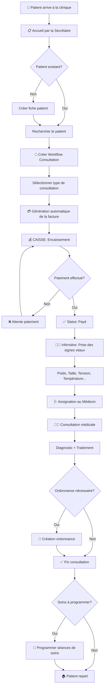

# Workflow de Consultation - Passage par la Caisse

## Vue d'ensemble

Ce document décrit le processus complet d'une consultation médicale dans CliniCare, depuis l'arrivée du patient jusqu'à sa sortie, en passant par l'encaissement à la caisse.

---

## Diagramme du Workflow



---

## Étapes Détaillées

### 1. Accueil du Patient (Secrétaire)

**Responsable :** Secrétaire

**Actions :**
- Accueillir le patient à la réception
- Vérifier si le patient existe déjà dans le système
  - **Patient existant :** Rechercher par nom, prénom ou numéro de téléphone
  - **Nouveau patient :** Créer une nouvelle fiche patient avec toutes les informations requises

**Informations à collecter pour un nouveau patient :**
| Champ | Obligatoire | Description |
|-------|-------------|-------------|
| Nom | ✅ | Nom de famille |
| Prénom | ✅ | Prénom(s) |
| Date de naissance | ✅ | Format JJ/MM/AAAA |
| Sexe | ✅ | Masculin / Féminin |
| Téléphone | ✅ | Numéro principal |
| Adresse | ✅ | Adresse complète |
| Contact d'urgence | ✅ | Nom et téléphone |
| Email | ❌ | Adresse email |
| Groupe sanguin | ❌ | A+, A-, B+, B-, AB+, AB-, O+, O- |
| Allergies | ❌ | Liste des allergies connues |

**Navigation dans l'application :**
> Menu → Patients → Nouveau Patient

---

### 2. Création du Workflow de Consultation (Secrétaire)

**Responsable :** Secrétaire

**Actions :**
1. Accéder au module **Workflow de Consultation**
2. Sélectionner le patient concerné
3. Choisir le **type de consultation** :
   - Consultation Générale
   - Consultation Gynécologique
   - Consultation Spécialisée
   - Urgence
   - Suivi
   - Préventive

**Résultat :** Une facture est automatiquement générée avec le tarif correspondant au type de consultation.

**Navigation dans l'application :**
> Menu → Workflow → Nouvelle Consultation

---

### 3. Encaissement à la Caisse (Secrétaire)

**Responsable :** Secrétaire

**Actions :**
1. Afficher la facture générée
2. Informer le patient du montant à payer
3. Sélectionner le mode de paiement :
   - 💵 Espèces (Cash)
   - 💳 Carte bancaire
   - 📱 Mobile Money
   - 🏦 Virement bancaire
   - 📝 Chèque
4. Enregistrer le paiement
5. Imprimer le reçu si nécessaire

**Statuts de la facture :**
| Statut | Description | Couleur |
|--------|-------------|---------|
| En attente | Paiement non effectué | 🟡 Jaune |
| Payée | Paiement validé | 🟢 Vert |
| En retard | Délai de paiement dépassé | 🔴 Rouge |

**⚠️ Important :** Le patient ne peut passer à l'étape suivante (prise des signes vitaux) qu'après validation du paiement.

**Navigation dans l'application :**
> Workflow → Sélectionner le patient → Encaisser

---

### 4. Prise des Signes Vitaux (Infirmière)

**Responsable :** Infirmière

**Prérequis :** Le paiement doit être validé (statut "Payé")

**Actions :**
1. Appeler le patient en salle de préparation
2. Mesurer et enregistrer les signes vitaux :

| Paramètre | Unité | Valeurs normales adulte |
|-----------|-------|------------------------|
| Poids | kg | Variable |
| Taille | cm | Variable |
| Température | °C | 36.5 - 37.5 |
| Tension artérielle systolique | mmHg | 90 - 140 |
| Tension artérielle diastolique | mmHg | 60 - 90 |
| Fréquence cardiaque | bpm | 60 - 100 |
| Fréquence respiratoire | /min | 12 - 20 |
| Saturation en oxygène | % | 95 - 100 |

3. Ajouter des observations si nécessaire
4. Valider les signes vitaux

**Navigation dans l'application :**
> Workflow → File d'attente → Sélectionner patient → Signes Vitaux

---

### 5. Assignation au Médecin (Secrétaire/Système)

**Responsable :** Secrétaire ou automatique selon configuration

**Actions :**
1. Vérifier les médecins disponibles
2. Assigner le patient au médecin approprié selon :
   - La spécialité requise
   - La disponibilité
   - La charge de travail

**Résultat :** Le patient apparaît dans la file d'attente du médecin assigné.

**Navigation dans l'application :**
> Workflow → Sélectionner patient → Assigner Médecin

---

### 6. Consultation Médicale (Médecin)

**Responsable :** Médecin

**Actions :**
1. Appeler le patient en salle de consultation
2. Consulter les signes vitaux enregistrés
3. Interroger le patient (anamnèse)
4. Effectuer l'examen clinique
5. Établir le diagnostic
6. Définir le plan de traitement
7. Créer le dossier médical avec :
   - Motif de consultation
   - Symptômes
   - Diagnostic
   - Traitement prescrit
   - Notes complémentaires

**Navigation dans l'application :**
> Consultations → Ma File d'Attente → Sélectionner Patient → Nouvelle Consultation

---

### 7. Prescription Médicale (Médecin)

**Responsable :** Médecin

**Condition :** Si un traitement médicamenteux est nécessaire

**Actions :**
1. Ajouter une ordonnance au dossier médical
2. Pour chaque médicament :
   - Nom du médicament
   - Dosage
   - Fréquence (ex: 3 fois par jour)
   - Durée (ex: 7 jours)
   - Instructions spéciales

3. Imprimer l'ordonnance pour le patient

**Navigation dans l'application :**
> Consultation en cours → Ajouter Prescription

---

### 8. Programmation des Soins (Médecin/Infirmière)

**Responsable :** Médecin ou Infirmière

**Condition :** Si des soins de suivi sont nécessaires (injections, pansements, etc.)

**Actions :**
1. Créer une série de séances de soins
2. Définir :
   - Type de soin
   - Nombre de séances
   - Fréquence
   - Dates programmées

**Résultat :** Les séances apparaissent dans le tableau de bord de l'infirmière.

**Navigation dans l'application :**
> Soins → Programmer Séances

---

### 9. Fin de la Consultation

**Résultat final :**
- ✅ Dossier médical créé et enregistré
- ✅ Ordonnance remise au patient (si applicable)
- ✅ Séances de soins programmées (si applicable)
- ✅ Facture payée et archivée
- ✅ Patient peut quitter la clinique

---

## Récapitulatif des Responsabilités

| Étape | Secrétaire | Infirmière | Médecin |
|-------|:----------:|:----------:|:-------:|
| Accueil patient | ✅ | | |
| Création fiche patient | ✅ | | |
| Création workflow | ✅ | | |
| Encaissement | ✅ | | |
| Signes vitaux | | ✅ | |
| Assignation médecin | ✅ | | |
| Consultation | | | ✅ |
| Diagnostic | | | ✅ |
| Prescription | | | ✅ |
| Programmation soins | | ✅ | ✅ |

---

## Statuts du Workflow

Le workflow de consultation passe par les statuts suivants :

```
┌─────────────────┐     ┌─────────────────┐     ┌─────────────────┐
│ payment-pending │ ──► │   vital-signs   │ ──► │ doctor-assigned │
│  (Attente paie) │     │ (Signes vitaux) │     │(Médecin assigné)│
└─────────────────┘     └─────────────────┘     └─────────────────┘
                                                        │
                                                        ▼
                        ┌─────────────────┐     ┌─────────────────┐
                        │    completed    │ ◄── │ in-consultation │
                        │   (Terminé)     │     │(En consultation)│
                        └─────────────────┘     └─────────────────┘
```

| Statut | Description |
|--------|-------------|
| `payment-pending` | En attente de paiement à la caisse |
| `vital-signs` | Paiement effectué, en attente des signes vitaux |
| `doctor-assigned` | Signes vitaux pris, médecin assigné |
| `in-consultation` | Consultation en cours avec le médecin |
| `completed` | Consultation terminée |

---

## Conseils et Bonnes Pratiques

### Pour la Secrétaire
- ✅ Toujours vérifier l'identité du patient avant de créer un dossier
- ✅ S'assurer que toutes les informations obligatoires sont renseignées
- ✅ Confirmer le mode de paiement avant validation
- ✅ Imprimer le reçu pour le patient

### Pour l'Infirmière
- ✅ Calibrer régulièrement les appareils de mesure
- ✅ Prendre les mesures dans un environnement calme
- ✅ Noter toute anomalie dans les observations
- ✅ Alerter le médecin en cas de valeurs critiques

### Pour le Médecin
- ✅ Consulter les antécédents du patient avant la consultation
- ✅ Vérifier les signes vitaux avant l'examen
- ✅ Documenter clairement le diagnostic et le traitement
- ✅ Expliquer l'ordonnance au patient

---

## Cas Particuliers

### Urgence
En cas d'urgence médicale, le workflow peut être accéléré :
1. Le paiement peut être différé
2. Les signes vitaux peuvent être pris directement par le médecin
3. La consultation est prioritaire

### Consultation de Suivi
Pour une consultation de suivi :
1. Le dossier précédent est accessible
2. Les signes vitaux peuvent être comparés aux précédents
3. Le tarif peut être différent (consultation de suivi)

---

## Support

En cas de problème avec le workflow :
1. Contacter l'administrateur système
2. Vérifier les logs dans le système
3. Consulter la documentation technique

---

*Document mis à jour le : Décembre 2024*
*Version : 1.0*
